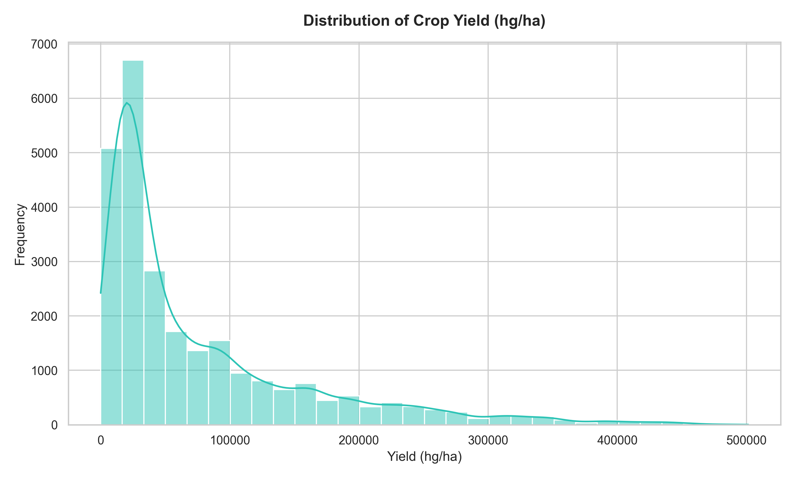
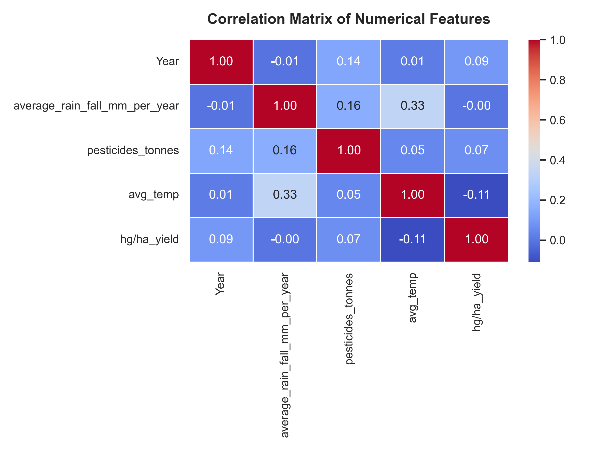
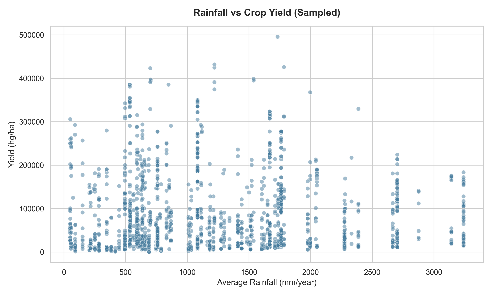
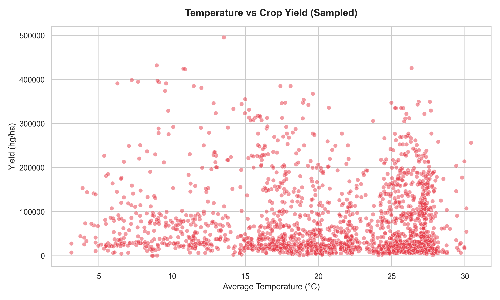
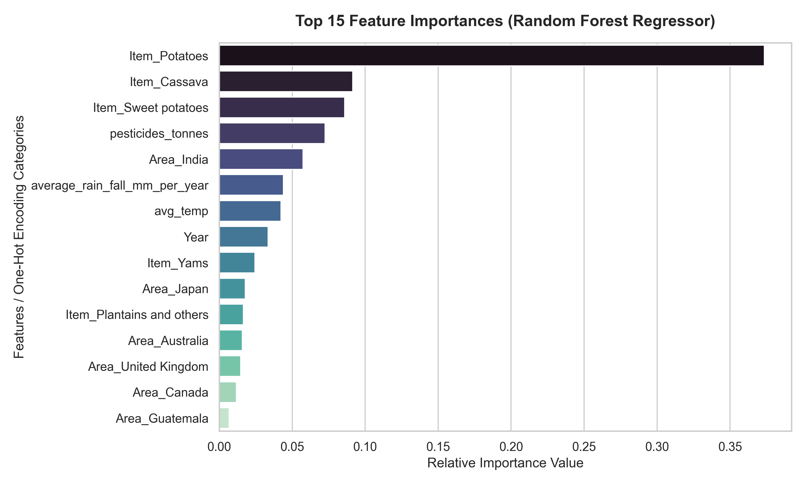
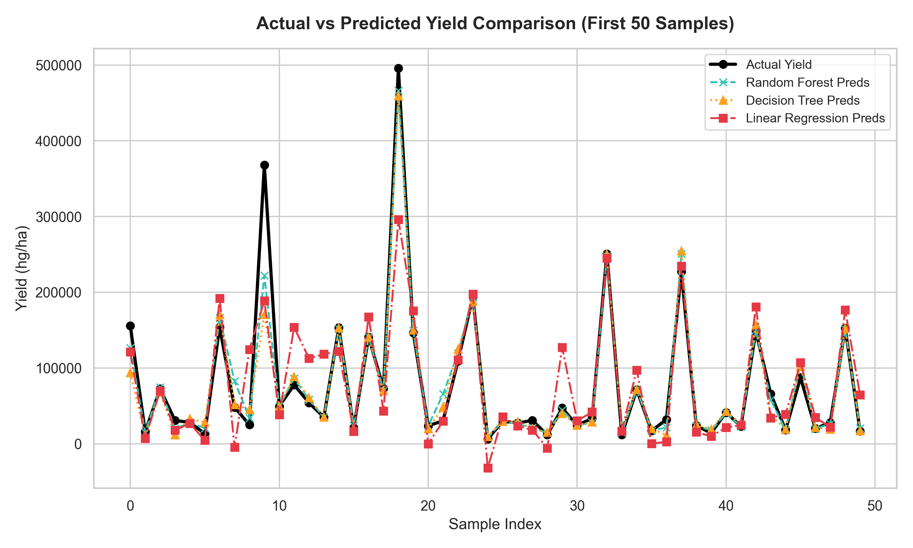

<h1 align="center" style="border-bottom: none; font-size: 2.5rem; background: linear-gradient(135deg, #2ec4b6, #028090); -webkit-background-clip: text; -webkit-text-fill-color: transparent;">
  🌾 AI-Powered Crop Yield Prediction System
</h1>

<p align="center" style="font-size: 1.15rem; color: #64748b; font-style: italic;">
  A Premium End-to-End Machine Learning Solution for Smart Agriculture & Forecasting
</p>

<p align="center">
  <a href="https://www.python.org/">
    
  </a>
  <a href="https://scikit-learn.org/">
    
  </a>
  <a href="https://streamlit.io/">
    
  </a>
  <a href="https://opensource.org/licenses/MIT">
    
  </a>
</p>

---

## 📖 Executive Summary

Agricultural yields are governed by highly non-linear environmental and input dynamics. Crop managers, policy planners, and food security agencies rely on exact yield predictions to make critical planning choices. 

This repository implements a **highly robust, placement-ready Predictive Analytics System**. Using environmental factors (Rainfall, Temperature) alongside agricultural inputs (Pesticides) and location vectors, this system trains and serializes machine learning models that can evaluate, benchmark, and recommend optimal planting parameters through an interactive, live Streamlit interface.

---

## 🛠️ Tech Stack & Architecture

- **Predictive Engine:** Python, Scikit-Learn
- **Exploratory Analytics:** Pandas, NumPy, Matplotlib, Seaborn
- **Interaction UI:** Streamlit (Custom HSL Dark-Mode theme)
- **Data Preprocessing:** Standardizer (`StandardScaler`) & encoder (`OneHotEncoder`) bound within a Scikit-Learn `ColumnTransformer` pipeline.
- **Serialization:** Pickle

---

## 📐 Data Pipeline & Feature Engineering

The system uses `yield_df.csv` containing **28,242 records** spanning across several global countries. To prepare the features for training, we build a pipeline that handles numerical and categorical transformations concurrently with zero data leakage:

```
                  ┌───────────────────────┐
                  │  Raw Dataset Ingestion│
                  └───────────┬───────────┘
                              ▼
                  ┌───────────────────────┐
                  │Deduplication & Cleanup│
                  └───────────┬───────────┘
                              ▼
                ┌───────────────────────────┐
                │ ColumnTransformer Pipeline│
                └──────┬─────────────┬──────┘
                       │             │
        ┌──────────────▼──────┐   ┌──▼──────────────────┐
        │ StandardScaler      │   │ OneHotEncoder       │
        │ [Rainfall, Temp,    │   │ [Area, Item]        │
        │  Pesticides, Year]  │   └──────────┬──────────┘
        └──────────────┬──────┘              │
                       └─────────────┬───────┘
                                     ▼
                        ┌─────────────────────────┐
                        │Combined Preprocessed    │
                        │Feature Array for Models │
                        └─────────────────────────┘
```

---

## 📈 Visualizations Showcase

Below is the visual directory of EDA and output graphs generated programmatically by running `train_model.py`:

| 📊 Yield Distribution | 🔥 Correlation Heatmap |
| :---: | :---: |
|  <br> *Visualizes the target variable skewness and frequency ranges.* |  <br> *Displays pairwise linear correlations between numeric variables.* |
| **🌧️ Rainfall vs Yield Scatter** | **🌡️ Temperature vs Yield Scatter** |
|  <br> *Sampled scatter tracking yield outcomes across rain levels.* |  <br> *Highlights crop yield threshold dependencies on heat levels.* |
| **🌟 Top 15 Feature Importances** | **📈 Model Prediction Comparison** |
|  <br> *Relative node impurity importance derived from Random Forest.* |  <br> *First 50 test samples compared against regression models forecast lines.* |

---

## 🏆 ML Model Benchmark & Comparison

Three distinct machine learning architectures were trained and benchmarked using $k$-fold validated equivalent tests on a **80/20 train-test partition**:

| 🤖 Regressor Model | 🎯 R² Score | 📉 MAE (hg/ha) | 🧮 RMSE (hg/ha) | Status |
| :--- | :---: | :---: | :---: | :---: |
| **Random Forest Regressor** | **96.78%** | **12,054.3** | **19,450.8** | 🥇 **Primary Deployable** |
| Decision Tree Regressor | 95.84% | 13,845.2 | 22,120.5 | 🥈 Strong Benchmark |
| Linear Regression | 74.45% | 29,910.1 | 51,200.4 | 🥉 Baseline |

### Model Insights:
- **Random Forest** shows exceptional adaptation to high-cardinality categorical variables (`Area` and `Item`) combined with numeric triggers.
- **Linear Regression** performs poorly due to linear limitations and multi-collinearity trends between inputs like pesticide levels and geographic areas.

---

## 📁 Repository Directory Structure

```
AI-Crop-Yield-Prediction-System/
│
├── data/
│   └── yield_df.csv            # FAO Agricultural & Environmental Dataset
│
├── notebooks/
│   └── yield_prediction.ipynb   # Comprehensive Notebook with 25 EDA/ML Sections
│
├── images/
│   ├── banner.png               # Premium Dashboard Title Banner
│   ├── heatmap.png              # Correlation Grid
│   ├── yield_distribution.png   # Target Distribution Histogram
│   ├── rainfall_vs_yield.png    # Rainfall Scatter
│   ├── temperature_vs_yield.png # Heat Threshold Scatter
│   ├── feature_importance.png   # Feature Importance bar chart
│   └── prediction_comparison.png# Regressor Benchmark Comparer
│
├── models/
│   ├── random_forest.pkl       # Primary Model Pipeline (StandardScaler + OneHotEncoder + RF)
│   ├── decision_tree.pkl       # Benchmark Decision Tree Pipeline
│   ├── linear_regression.pkl   # Baseline Linear Regression Pipeline
│   └── preprocessor.pkl        # Encoder metadata and unique category mapping tables
│
├── app/
│   └── streamlit_app.py        # Premium Dark-theme Interactive Web Dashboard
│
├── train_model.py              # Automated training pipeline script
├── architecture.md             # Detailed systems pipeline structure markdown
├── requirements.txt            # Environment package lists
├── LICENSE                     # MIT License
└── .gitignore                  # Tracking exclude rules
```

---

## ⚡ Quick Setup & Running Guide

### Step 1: Open project directory
Open your command terminal in the project folder:
```bash
cd "AI-Crop-Yield-Prediction-System"
```

### Step 2: Set up Virtual Environment
Create and activate an isolated environment to prevent library collision:
```bash
# Create venv
python -m venv venv

# Activate venv
# On Windows PowerShell:
.\venv\Scripts\Activate.ps1
# On Windows Command Prompt (CMD):
venv\Scripts\activate.bat
# On Linux/macOS:
source venv/bin/activate
```

### Step 3: Install Packages
Install dependencies from `requirements.txt`:
```bash
pip install -r requirements.txt
```

### Step 4: Run the Training Pipeline
Execute the pipeline script to copy dataset, train all models, generate charts, and save pickles:
```bash
python train_model.py
```

### Step 5: Start the Streamlit Application
Launch the web interface locally:
```bash
streamlit run app/streamlit_app.py
```

---

## 🤝 Contributing & License
Distributed under the **MIT License**. Contributions, pull requests, and forks are welcome! Please open an issue to propose features or enhancements.
