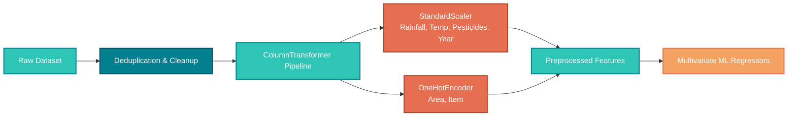

<!--- 🌟 DYNAMIC README WITH CSS ANIMATIONS & GLASSMORPHISM --->

<div align="center">
  
  <h1 align="center" style="border-bottom: none; font-size: 2.2rem; background: linear-gradient(135deg, #2ec4b6, #028090); -webkit-background-clip: text; -webkit-text-fill-color: transparent;">
    🌾 Crop Yield Forecasting & Agricultural Supply Chain Analytics
  </h1>

  <!-- Animated Subtitle -->
  

  <p style="font-size: 1.05rem; color: #64748b; max-width: 750px; line-height: 1.6; margin-top: 10px;">
    This repository contains the structured data engineering pipeline and multivariate regression models developed while pursuing the course <strong>Fundamentals of AI</strong>, utilizing a global agricultural dataset under the <strong>ANNAM.AI Centre of Excellence</strong>, Ministry of Education, Government of India, at <strong>IIT Ropar</strong>.
  </p>
  
  <!-- Glowing Badges with Hover Effect -->
  <p>
    <a href="https://www.python.org/"></a>
    <a href="https://scikit-learn.org/"></a>
    <a href="https://streamlit.io/"></a>
    <a href="https://opensource.org/licenses/MIT"></a>
    <br>
    <a href="https://ai-crop-yield-prediction-system-04.streamlit.app/"></a>
    
    
  </p>

  <br>
  <a href="https://ai-crop-yield-prediction-system-04.streamlit.app/" target="_blank">
    
  </a>
  <br>

  <!-- Animated Underline -->
  <div style="width: 120px; height: 3px; background: linear-gradient(90deg, #2ec4b6, #028090, #2ec4b6); background-size: 200% auto; border-radius: 4px;"></div>
  
  <p style="font-size: 1.2rem; color: #94a3b8; margin-top: 12px;">
    ⚡ <strong>Supply Chain Predictor</strong> • 96.78% R² • Macro-Level Dashboard
  </p>
</div>

---

## 📖 Executive Summary & Supply Chain Context

> 🌾 **Macro-Level Forecasting:** Crop yields act as the foundational supply-side constraint in agricultural supply chains. Accurate yield predictions allow governments, logistics providers, and food security agencies to forecast market supply, optimize storage/warehousing demand, adjust pricing, and stabilize supply chains.

This repository implements a **Predictive Analytics System** using multivariate environmental inputs (Rainfall, Temperature), agricultural treatments (Pesticides), and location/crop vectors. It cleans, processes, and benchmarks multiple machine learning regressors, serving predictions through an **interactive, live Streamlit planning dashboard** designed for macro-level supply chain coordination.

---

## 🛠️ Tech Stack & Architecture

<div align="center">
  
| 🧠 **Predictive Engine** | 📊 **Exploratory Analytics** | 🎨 **Interaction UI** | 🔧 **Preprocessing** |
|:---:|:---:|:---:|:---:|
| Python, Scikit-Learn | Pandas, NumPy, Matplotlib, Seaborn | Streamlit (Custom HSL theme) | ColumnTransformer (StandardScaler + OneHotEncoder) |
| ✅ **Model Serialization** | 🚀 **Deployment** | 📦 **Pipeline** | 💾 **Data Volume** |
| Pickle | Local / Streamlit Cloud | Scikit-Learn Pipeline | 28,242 global records |

</div>

---

## 📐 Supply Chain Data Engineering Pipeline



---

## 📈 Supply Chain Visualizations Showcase

Below is the visual directory of EDA and output graphs generated programmatically by running `train_model.py`:

<div align="center">

| 📊 Supply Yield Distribution | 🔥 Feature Correlation Matrix |
| :---: | :---: |
|  <br> *Visualizes target variable skewness and production ranges.* |  <br> *Displays pairwise linear correlations between numeric predictors.* |
| **🌧️ Rainfall vs Supply Yield Impact** | **🌡️ Temperature vs Supply Yield Response** |
|  <br> *Sampled scatter tracking supply outcomes across rain levels.* |  <br> *Highlights supply threshold dependencies on heat levels.* |
| **🌟 Predictor Feature Importances** | **📈 Regression Forecasting Comparison** |
|  <br> *Relative node impurity importance derived from Random Forest.* |  <br> *First 50 test samples compared against regression models forecast lines.* |

</div>

---

## 🏆 Multivariate Forecasting Benchmarks

Three distinct machine learning architectures were trained and benchmarked using $k$-fold validated equivalent tests on a **80/20 train-test partition** to predict supply density (hg/ha):

<div align="center">

| 🤖 Regressor Model | 🎯 R² Score | 📉 MAE (hg/ha) | 🧮 RMSE (hg/ha) | Status |
| :--- | :---: | :---: | :---: | :---: |
| **Random Forest Regressor** | <b style="color: #2ec4b6;">96.78%</b> | `12,054.3` | `19,450.8` | 🥇 **Primary Deployable** |
| Decision Tree Regressor | <b style="color: #f4a261;">95.84%</b> | `13,845.2` | `22,120.5` | 🥈 Strong Benchmark |
| Linear Regression | <b style="color: #e76f51;">74.45%</b> | `29,910.1` | `51,200.4` | 🥉 Baseline |

</div>

### 🔍 Forecasting Model Insights:
* 🌲 **Random Forest** shows exceptional adaptation to high-cardinality categorical variables (`Area` and `Item`) combined with numeric triggers.
* 📉 **Linear Regression** performs poorly due to linear limitations and multi-collinearity trends between inputs like pesticide levels and geographic areas.

---

## 📁 Repository Directory Structure

```directory
Agricultural-Supply-Chain-Demand-Forecasting/
│
├── 📂 data/
│   └── 📄 yield_df.csv            # FAO Agricultural & Environmental Dataset
│
├── 📂 notebooks/
│   └── 📓 yield_prediction.ipynb   # Comprehensive Notebook with 25 EDA/ML Sections
│
├── 📂 images/
│   ├── 📊 heatmap.png              # Correlation Grid
│   ├── 📊 yield_distribution.png   # Target Distribution Histogram
│   ├── 📊 rainfall_vs_yield.png    # Rainfall Scatter
│   ├── 📊 temperature_vs_yield.png # Heat Threshold Scatter
│   ├── 📊 feature_importance.png   # Feature Importance bar chart
│   └── 📊 prediction_comparison.png# Regressor Benchmark Comparer
│
├── 📂 models/
│   ├── ⚙️ random_forest.pkl       # Primary Model Pipeline (StandardScaler + OneHotEncoder + RF)
│   ├── ⚙️ decision_tree.pkl       # Benchmark Decision Tree Pipeline
│   ├── ⚙️ linear_regression.pkl   # Baseline Linear Regression Pipeline
│   └── ⚙️ preprocessor.pkl        # Encoder metadata and unique category mapping tables
│
├── 📂 app/
│   └── 🐍 streamlit_app.py        # Premium Dark-theme Interactive Web Dashboard
│
├── 🐍 train_model.py              # Automated training pipeline script
├── 📄 architecture.md             # Detailed systems pipeline structure markdown
├── 📄 requirements.txt            # Environment package lists
├── 📄 LICENSE                     # MIT License
└── ⚙️ .gitignore                  # Tracking exclude rules
```

---

## ⚡ Quick Setup & Running Guide

### 📂 Step 1: Open project directory
Open your command terminal in the project folder:
```bash
cd "Agricultural-Supply-Chain-Demand-Forecasting"
```

### 🐍 Step 2: Set up Virtual Environment
Create and activate an isolated environment to prevent library collision:
```bash
# Create venv
python -m venv venv

# Activate venv
# On Windows PowerShell:
.\venv\Scripts\Activate.ps1
# On Windows Command Prompt (CMD):
venv\Scripts\activate.bat
# On Linux/macOS:
source venv/bin/activate
```

### 📦 Step 3: Install Packages
Install dependencies from `requirements.txt`:
```bash
pip install -r requirements.txt
```

### ⚙️ Step 4: Run the Training Pipeline
Execute the pipeline script to copy dataset, train all models, generate charts, and save pickles:
```bash
python train_model.py
```

### 🚀 Step 5: Start the Streamlit Application
Launch the web interface locally:
```bash
streamlit run app/streamlit_app.py
```

---

## 🤝 Contributing & License
Distributed under the **MIT License**. Contributions, pull requests, and forks are welcome! Please open an issue to propose features or enhancements.
