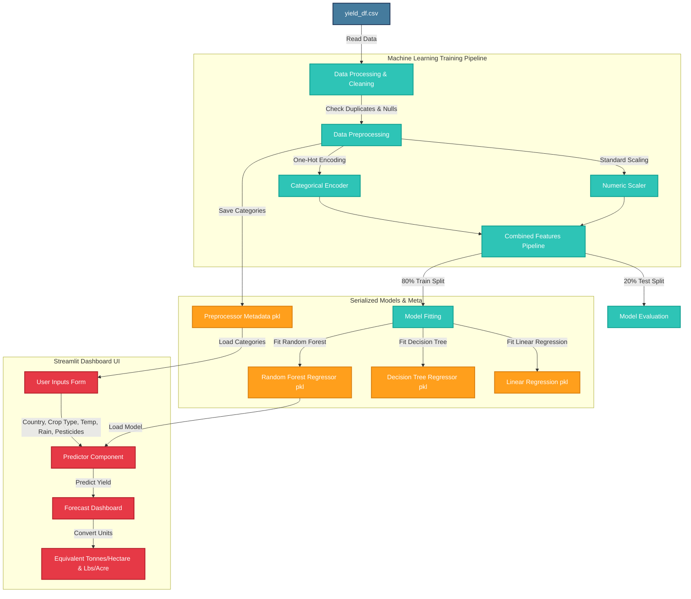

# 🏗️ System Architecture - AI Crop Yield Prediction System

This document outlines the system architecture, pipeline, data flows, and technological components of the **AI-Powered Crop Yield Prediction System**.

---

## 🗺️ High-Level System Architecture

The project is structured as an end-to-end Machine Learning deployment, integrating a robust data preprocessing and training pipeline with a modern, user-friendly interactive interface.

---

## ⚙️ Core Component Description

### 1. Data Processing and Cleaning Pipeline
- **Raw Data Ingestion:** Reads the raw dataset from `data/yield_df.csv`.
- **Deduplication:** Drops index duplication issues arising from multi-source merges.
- **Handling Missing Values:** Validates missing rows.

### 2. Feature Engineering & Preprocessing
- **Categorical Columns Encoding:** `Area` (Country) and `Item` (Crop Type) are encoded using **One-Hot Encoding** to handle multi-category labels without imposing arbitrary ordinal values.
- **Numerical Scaling:** Environment and agricultural inputs (`average_rain_fall_mm_per_year`, `pesticides_tonnes`, `avg_temp`, and `Year`) are normalized using `StandardScaler` to prevent feature magnitude bias.
- **Scikit-Learn ColumnTransformer Pipeline:** Bundles scaling and encoding steps into a single reusable object (`ColumnTransformer`), ensuring zero data leakage between train/test splits.

### 3. Machine Learning Models
- **Primary Model: Random Forest Regressor** (Ensemble bagging regressor utilizing decision trees with bootstrapped samples. Yields optimal performance due to high non-linear complexity modeling capability).
- **Secondary Model: Decision Tree Regressor** (Single decision tree for capturing branching logical conditions).
- **Benchmark Model: Linear Regression** (Standard Ordinary Least Squares linear benchmark).

### 4. Interactive Dashboard
- **Web App Interface:** Built with **Streamlit** using customized premium glassmorphism layouts.
- **Dynamic Selectors:** Dropdowns are populated directly from the dataset unique values stored in the preprocessor metadata.
- **Conversion Subsystem:** Automatically translates yield from Hectograms per Hectare (`hg/ha`) into Metric Tonnes per Hectare (`t/ha`) and Pounds per Acre (`lbs/acre`).
